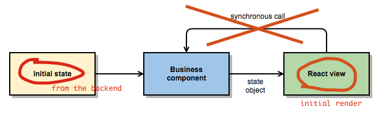

# React+Bacon.js isomorphic TodoMVC

## Motivation

Isomorphic applications are the hottest topic nowadays (May 2015).
New tutorials about isomorphic app creation are springing up like 
mushrooms after the rain. I do not get this because React+FRP 
applications are isomorphic by default. This project demonstrates
how enable isomorphism in your FRP+React app.


## How it works?

Because the FRP encourages you to always pass the entire state object 
to the rendering function, nothing prevents you to do the same in 
the backend as well.



So in order to create isomorphic apps, just remember:

* Eliminate browser/Node specific dependencies from your isomorphic modules
* DRY!

For more information, read [my blog post](https://medium.com/@milankinen/isomorphic-apps-normal-react-frp-apps-63a2177f7eac).

## Playing with the project

Feel free to clone the repository and start playing with the project:

```bash 
git clone git@github.com:milankinen/react-bacon-isomorphic.git
cd react-bacon-isomorphic
npm install
npm run watch
open http://localhost:3000  # osx only
```

## License

MIT

